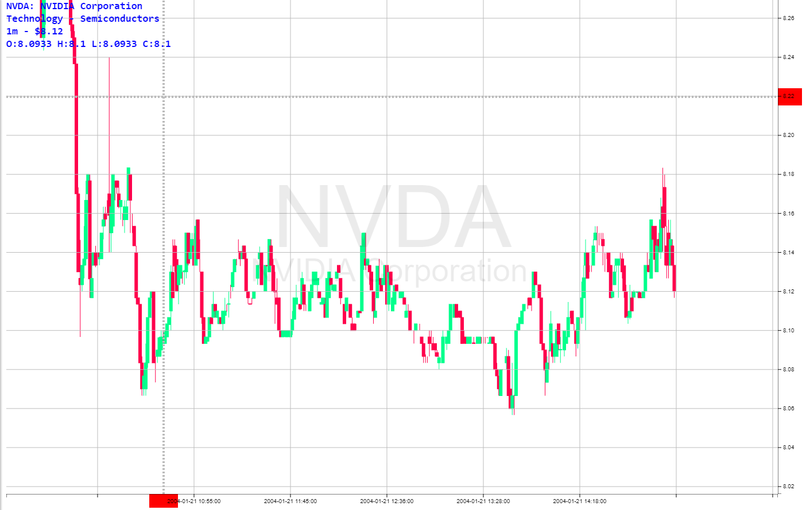

#  Candlestick Graph using React, D3FC and WebGL

  This project uses WebGL to render a candlestick price chart. React is a front-end Javascript framework that can utilize the D3 and D3FC libraries to leverage the power of WebGL for visualizing time series price data. WebGL is a JavaScript API for rendering interactive 2D and 3D graphics within any compatible web browser. Typical charts that use SVG type rendering can only handle a limited amount of data. Noticeable performance issues occur when several tens of thousands of datapoints need to be rendered; panning becomes slower and interacting with the chart is a lot more choppy.
  

  
  Theoretically this problem doesn't occur when using WebGL, which can handle displaying datasets of over 1 million points. Large datasets can be directly observed in scatter plot graphs or large mapping applications but WebGL can be useful for rendering time-series data as well. In this case, a long-dated candlestick price chart with multiple subplots and complimentary datasets can easily overload any SVG based application which makes WebGL an interesting alternative for a task such as this. 
  
  This file demonstrates how to structure a react component to work with D3/D3FC and handle data dynamically. Some tweaks have been made to accomodate for custom panning and dragging functionality and incorporated zoom sync. Other aspects of the chart such as crosshairs, gridlines and axes labels have all been set up in ways that are more consistant with the D3FC architecture and employ various unconventional methods of implementation. 
 
